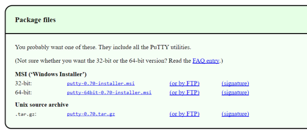
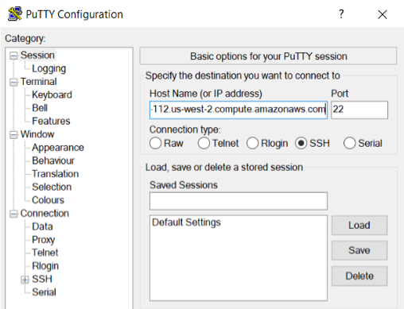
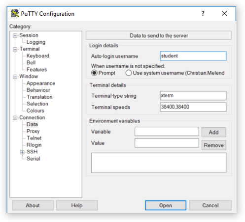
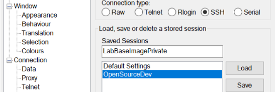
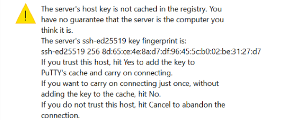
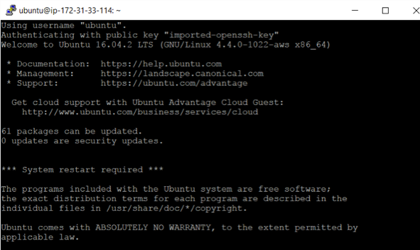
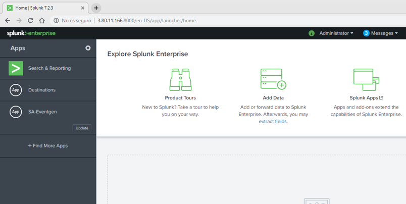

# Virtual Machine Connection Guide for Splunk Labs

Thank you for participating in our hands-on workshop. We are glad to have you in our class! This class relies on our accompanying lab environment which provides access to all the assets you will need to practice the skills taught in class. In order for the workshop to be successful, we need assurance that the lab environment will function properly on each student’s computer/network. Please perform the tests described herein **at least two weeks** before your class and inform your **ASPE** program manager immediately if you encounter any issues.  

## Course lab:  Linux Servers – Putty / Ubuntu

1.	You need to perform the SSH connectivity tests to **two different servers**.
2.	Navigate to the **Putty: latest release** page, and download the appropriate **Putty exe**. 

    https://www.chiark.greenend.org.uk/~sgtatham/putty/latest.html

     
            
3.	Locate the Installation Database in your Downloads folder, right click, and choose Install. Follow the installation directions until you click “Finish.”

     

4. Open the Putty Applicaiton.
        
    

5.	Enter the IP address **35.172.92.164** into the **Host name (or IP address)** section in the **Putty Configuration** window.
              
    

6.	Expand the **Connection** category in the left dropdown menu, select **Data**, and type the appropriate user name into the **Auto-login username** section. 

    Ubuntu:
    User Name: **student**

    

7.	In the **Putty Configuration** window, select the **Session** category, name your session under **Saved Sessions**, and click the **Save** button.

    

8.	Once it is saved, open your connection by clicking **Open**.  A warning dialogue will pop up and ask if you trust the selected host key.  Click the **Yes** button.

    
 
9.	When prompted, type *splunk* as the password for the student user.
10.	You should now be logged in to your specified Virtual Machine.

              

11.	If you see the above screen, you will be able to connect on the first day of class. When you re-launch **Putty** on the first day of class, your previous **SSH** connection details will be available since you saved the session details during the initial configuration. 

### Troubleshooting
If you are not able to connect, the most likely reason is that your IT department has blocked port 443, 3389 and/or 80. Please contact your IT department to submit a request to open those ports to the specific IP address of the computer or facility room from which you will take the training. Please contact ASPE directly if you require additional assistance. 

## Course lab:  Splunk UI
1.	Navigate with the browser of your choice
2.	The URL of Splunk is http://35.172.92.164:8000/ 
3.	Type **admin** for the user name

       

4.	Type **SplunkB00tcamp** for the password

     

5.	Confirm that you can see the welcome screen from Splunk

     

### Troubleshooting
If you are not able to connect, the most likely reason is that your IT department has blocked port 8000. Please contact your IT department to submit a request to open those ports to the specific IP address of the computer or facility room from which you will take the training. Please contact ASPE directly if you require additional assistance. 
