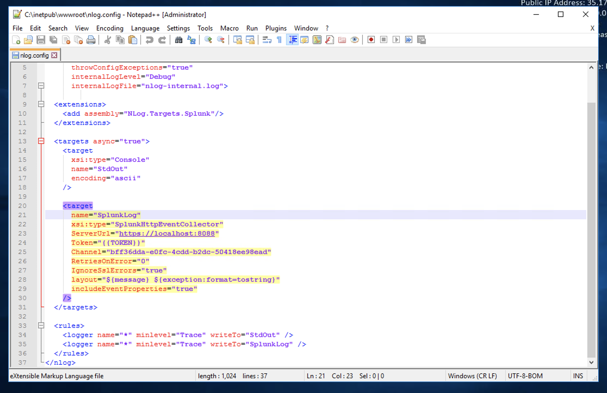
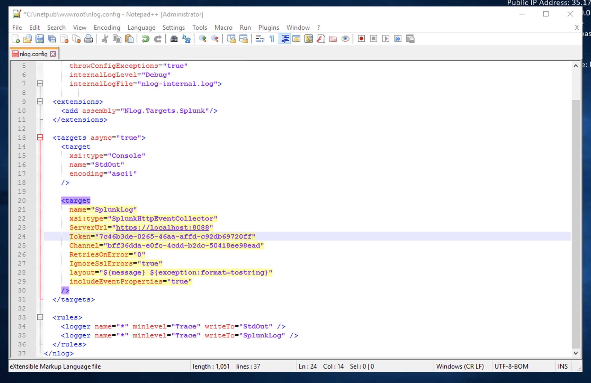
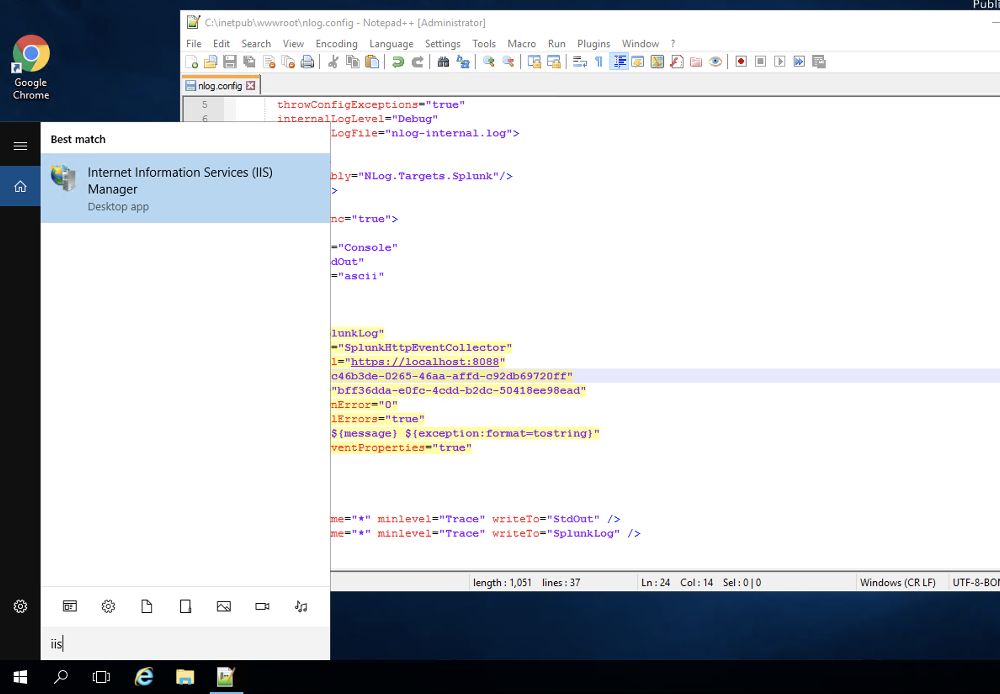
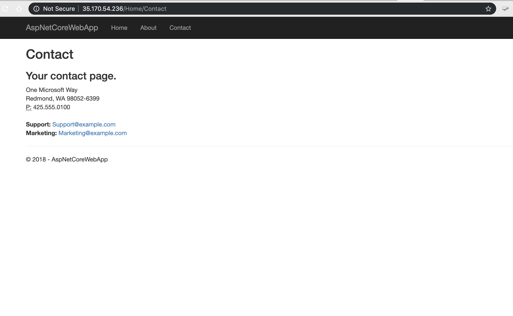
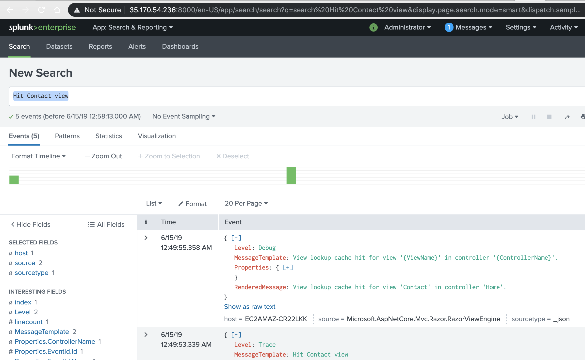

# Instrumenting Sites to Send Metrics to Splunk
Time: 40 minutes

## Instructions
It's time to start doing more complicated things in the Splunk instance. This time, you'll modify an existing web site in the server that will be sending metrics to Splunk.

### Configure the HEC
In the Splunk GUI,

- Click "Settings" > "Data Inputs"
- Under "Local Inputs," click "HTTP Event Collector"
- Verify that HEC is enabled
    - Click "Global Settings"
    - For "All Tokens," click "Enabled" if this button isn't already selected
    - Note the value for HTTP port number. That's the port the application will use to send data
    - Click "Save"
- Configure an HEC token for sending data by clicking "New Token"
- On the "Select Source" page, for "Name," enter a token name. For example, you could use "website token"
- Leave the other options blank or unselected
- Click "Next"
- In the "Select Allowed Indexes" choose (or click) "main"
- Next to "Default Index," choose (or click) "main"
- Click "Review," and then click "Submit"
- Copy the **token value** that's displayed, which you'll need to configure the website when replacing it with `{{TOKEN}}`

### Configure the website
You'll now RDP into the same Splunk instance to modify the configuration files to connect the application with Splunk.

- From the desktop, open Notepad++ by double-clicking the icon. It will ask you if you want to allow the application to make changes in the device. Click "Yes"
- A file called "nlog.config" will be opened by default. You'll see something like the following:

- Replace the word `{{TOKEN}}` with the one you copied from the previous section when configuring HEC. You'll have to have something like this:

- Save the file by clicking the "Save" button or pressing `Ctrl+Alt+S` in Notepad++
- Open the IIS server by clicking the "Search Windows" at the bottom, right next to the Windows button
- Type "IIS" and click in the "Internet Information Services (IIS) Manager"

- Expand the server name, and click in the "Application Pools" section
- Click in the "DefaultAppPool" item
- In the right side panel, click in the "Recycle..." button
- Restart the IIS service

- Open a new browser window with the IP address from the server you've been assigned
- Hit F5 a few times, and click in the link from the top menu (Home, About, and Contact)

- Go back to the Splunk GUI, and search for any event like "Hit Contact view." As long as you continue making requests to the website and you see that the number of events in Splunk increases, you're good.

